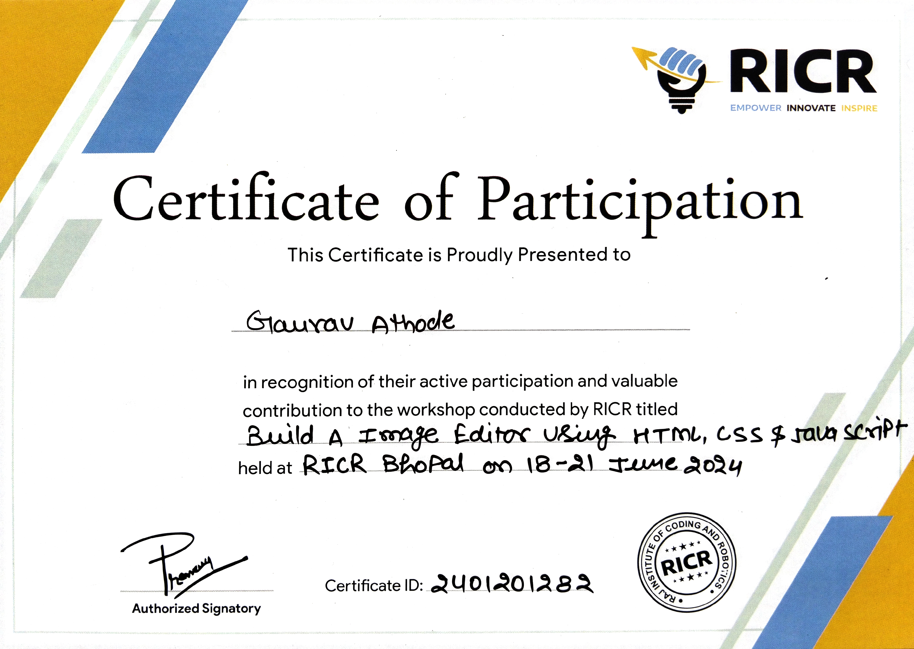

# Image Editor

## 📘 About This Repository

This repository contains a **simple Image Editor app** built using **HTML, CSS, and JavaScript**. It allows you to upload an image and apply various filters, rotate/flip, reset, and save the image.

---

## 🚀 Features

* Upload an image from your local machine
* Apply various filters to the image
* Rotate or flip the image
* Save the edited image
* Reset the image to its original state

---

## 🛠️ Pre-requisites

* A modern web browser (Chrome, Firefox, Safari, etc.)
* A local server to run the app (Live Server in VS Code recommended)

---

## 🎯 Outcome of the Project

* Layout design using HTML and CSS
* DOM manipulation and event handling using JavaScript
* Updating CSS styles dynamically using JavaScript
* Saving the manipulated image using the HTML Canvas API

---

## 📜 Certificate

This project was completed during a **3-Day Image Editor Bootcamp**.

**Bootcamp:** Image Editor using HTML, CSS & JavaScript
**Duration:** 3 Days

### Certificate Image

<<<<<<< HEAD

=======

>>>>>>> 57ff212c5cf4f1ea23b585e41714d8a4f4d0adf7

---

## 👨‍💻 Built With

Built with ♥ by **RICR**
